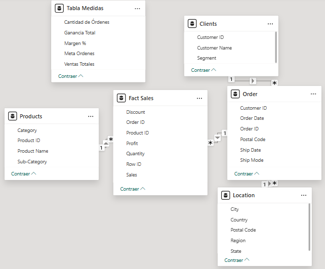
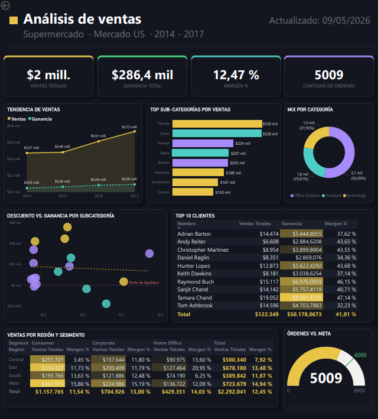

# Retail Store Business Intelligence Dashboard

This project presents an interactive Business Intelligence dashboard developed in Power BI for retail sales analysis.

The project includes data modeling, dimensional schema design, KPI analysis, and interactive visualizations for business insights.

## Objectives

- Analyze sales performance across different dimensions
- Build a star schema data model
- Create interactive dashboards and KPIs
- Identify trends and business patterns

## Tools and Technologies

- Power BI
- DAX
- Power Query
- Data Modeling
- Star Schema
- Business Intelligence

## Data Model

## Dashboard Preview

## Key Insights

- Sales increased significantly over time
- Certain regions generated higher profit margins
- Seasonal patterns were identified in customer purchases
- Product categories showed different profitability behaviors
